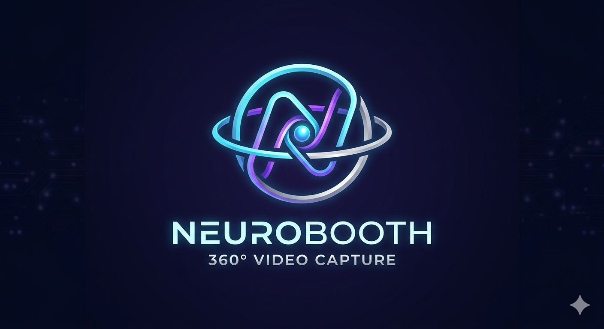

# NeuroBooth 360 🎥

<p align="center">
  
</p>

Application web professionnelle de type photomaton 360° — capture, partage et diffusion de vidéos depuis le navigateur. Conçue pour les événements, mariages, galas et soirées d'entreprise sur borne interactive ou tablette.


---

## ✨ Fonctionnalités

### 📹 Capture Vidéo
- Enregistrement natif via `MediaRecorder` (sans plugin)
- Compte à rebours configurable (0s, 3s, 5s, 10s)
- Durées flexibles : 10s, 15s, 30s, 1min, 2min
- Modes caméra : Frontale / Arrière
- Qualités : 480p, 720p HD, 1080p Full HD
- Audio activable/désactivable
- Mode plein écran immersif

### 🎡 Plateau Motorisé (ESP32)
- Contrôle du moteur via WebSerial / Bluetooth
- Réglage vitesse, direction et nombre de tours
- Synchronisation plateau / déclenchement d'enregistrement
- Modes de sync : ACK firmware, délai fixe, ou immédiat
- Panneau de contrôle moteur intégré dans l'interface

### 🔒 Mode Kiosque
- Verrouillage plein écran avec Wake Lock (écran toujours allumé)
- **Geste secret haut-centre :**
  - 5 taps → accès réglages admin (PIN requis)
  - 10 taps → quitter le kiosque (PIN requis)
- Feedback visuel : 5 puces indigo (réglages) + 5 puces rouges (exit)
- Badge kiosque et statut veille en superposition
- Bannière de reprise si plein écran interrompu
- PIN admin pour protéger les deux actions

### 📤 Partage & Stockage
- Upload automatique vers Supabase Storage avec barre de progression
- QR Code instantané après chaque prise
- Page de récupération mobile (téléchargement iOS/Android)
- Stockage local IndexedDB comme fallback hors-ligne
- Capture email opt-in avec envoi automatique de la vidéo

### 🎨 Interface & UX
- Design sombre avec Tailwind CSS 4
- 5 thèmes de couleur : Indigo, Rose, Ambre, Émeraude, Cyan
- Animations fluides avec Motion
- Retour haptique sur mobile
- Splash screen avec logo et nom de l'événement
- Header compact : nom événement, badge LIVE/REC, bouton plein écran
- Timer d'inactivité : retour splash après 5 minutes

### 📊 Analytics
- Suivi des captures, partages, téléchargements
- Dashboard analytique live pour l'organisateur
- Badge live stats en superposition
- Export et rapport d'événement

### 📱 PWA
- Installable sur iOS et Android (mode standalone)
- Service Worker avec cache offline
- Prompt d'installation et mise à jour automatique

### 🖼️ Galerie
- Affichage adaptatif : 1 col mobile → 5 cols desktop
- Autoplay au scroll (Intersection Observer)
- Modal plein écran avec contrôles vidéo
- Tri chronologique, pagination jusqu'à 1000 vidéos

---

## 🛠 Stack Technique

| Couche | Technologie |
|--------|-------------|
| UI | React 19 + TypeScript 5.8 |
| Build | Vite 6 + SWC |
| Style | Tailwind CSS 4 |
| Animations | Motion 12 |
| Backend | Supabase (DB + Storage + Auth) |
| Stockage local | IndexedDB |
| Navigation | React Router DOM 6 |
| QR Code | qrcode.react |
| Icônes | Lucide React |
| PWA | vite-plugin-pwa + Workbox |
| Matériel | WebSerial API (ESP32) |

---

## 📦 Installation

### Prérequis
- Node.js 18+
- npm ou yarn
- Compte Supabase (optionnel)

```bash
git clone https://github.com/votre-username/photobooth-360.git
cd photobooth-360
npm install
```

### Variables d'environnement

```env
VITE_SUPABASE_URL=votre_url_supabase
VITE_SUPABASE_ANON_KEY=votre_cle_anonyme
```

> Sans Supabase, l'app fonctionne en mode local avec IndexedDB.

### Commandes

```bash
npm run dev        # Développement (port 3000)
npm run build      # Build production
npm run preview    # Preview du build
npm run lint       # Vérification TypeScript
```

---

## 🏗 Structure du Projet

```
photobooth-360/
├── src/
│   ├── components/
│   │   ├── CameraView.tsx        # Flux caméra live
│   │   ├── PlaybackView.tsx      # Lecteur vidéo
│   │   ├── RecordButton.tsx      # Bouton enregistrement
│   │   ├── SplashScreen.tsx      # Écran d'accueil
│   │   ├── SettingsModal.tsx     # Réglages complets
│   │   ├── KioskGuard.tsx        # Mode kiosque + PIN
│   │   ├── ShareSection.tsx      # QR code + partage
│   │   ├── EmailCaptureModal.tsx # Collecte email
│   │   ├── MotorControlPanel.tsx # Contrôle plateau
│   │   ├── AnalyticsDashboard.tsx# Stats événement
│   │   ├── GalleryStrip.tsx      # Bande galerie
│   │   └── SlowMotionPanel.tsx   # Effets slow-mo
│   ├── hooks/
│   │   ├── useCamera.ts          # Gestion caméra
│   │   ├── useRecorder.ts        # Enregistrement
│   │   ├── useMotor.ts           # Contrôle moteur
│   │   ├── useKiosk.ts           # Mode kiosque
│   │   ├── useSettings.ts        # Persistance réglages
│   │   ├── useUpload.ts          # Upload cloud
│   │   ├── useAnalytics.ts       # Métriques
│   │   └── useSlowMotion.ts      # Slow motion
│   ├── lib/
│   │   ├── supabase.ts           # Client Supabase
│   │   ├── videoStore.ts         # IndexedDB vidéos
│   │   ├── settingsStore.ts      # Stockage réglages
│   │   ├── uploadVideo.ts        # Upload vidéo
│   │   ├── emailCapture.ts       # Capture emails
│   │   └── analytics.ts          # Tracking
│   ├── pages/
│   │   ├── GalleryPage.tsx       # Galerie complète
│   │   └── SharePage.tsx         # Page partage QR
│   ├── App.tsx
│   ├── main.tsx
│   └── index.css
├── firmware/
│   └── esp32_photobooth360/      # Code Arduino ESP32
├── public/
│   ├── manifest.json             # PWA manifest
│   └── offline.html              # Page hors-ligne
├── supabase/
│   └── functions/                # Edge Functions
├── .env.example
└── ROADMAP.md
```

---

## 🚀 Déploiement

### Vercel (recommandé)

```bash
npm i -g vercel
vercel --prod
```

### Netlify

```bash
npm run build
# Déployer le dossier dist/
```

Variables à configurer sur la plateforme :
- `VITE_SUPABASE_URL`
- `VITE_SUPABASE_ANON_KEY`

---

## 📱 Guide d'utilisation

### Organisateur

1. Accéder aux réglages via le geste secret (5 taps haut-centre) + PIN
2. Configurer : nom événement, logo, durée, compte à rebours, résolution, thème
3. Activer le mode kiosque pour verrouiller l'écran
4. Suivre les stats en direct depuis le dashboard analytique

### Invité

1. Taper l'écran splash pour démarrer
2. Appuyer sur le bouton rouge pour lancer l'enregistrement
3. Regarder le compte à rebours et sourire
4. Scanner le QR code pour récupérer sa vidéo

### Mode kiosque

- **5 taps** dans la zone haut-centre → PIN → réglages admin
- **10 taps** dans la zone haut-centre → PIN → exit kiosque

---

## 🔧 Configuration Supabase

```sql
-- Bucket de stockage
INSERT INTO storage.buckets (id, name, public)
VALUES ('photobooth360', 'photobooth360', true);

-- Table settings
CREATE TABLE settings (
  id UUID PRIMARY KEY DEFAULT uuid_generate_v4(),
  data JSONB NOT NULL,
  updated_at TIMESTAMP WITH TIME ZONE DEFAULT NOW()
);

-- Table captures email
CREATE TABLE email_captures (
  id UUID PRIMARY KEY DEFAULT uuid_generate_v4(),
  event_id TEXT,
  video_url TEXT,
  email TEXT,
  created_at TIMESTAMP WITH TIME ZONE DEFAULT NOW()
);
```

---

## 🎯 Roadmap

Voir `ROADMAP.md` pour le détail complet des phases.

**État actuel :**
- ✅ Phase 1 — Capture vidéo
- ✅ Phase 2 — Personnalisation & UX
- ✅ Phase 3 — Cloud & partage
- ✅ Phase 4 — Galerie & playback
- ✅ Phase 5 — Mode kiosque & opérateur
- ✅ Phase 6 — Moteur & matériel
- 🚧 Phase 7 — Effets & post-traitement
- 📋 Phase 8 — Analytics avancés & API

---

## 📄 Licence

MIT — voir `LICENSE`

## 💡 Support

- Issues : [GitHub Issues](https://github.com/votre-username/photobooth-360/issues)
- Email : support@neurobooth360.com

---

Développé avec ❤️ pour créer des souvenirs inoubliables
