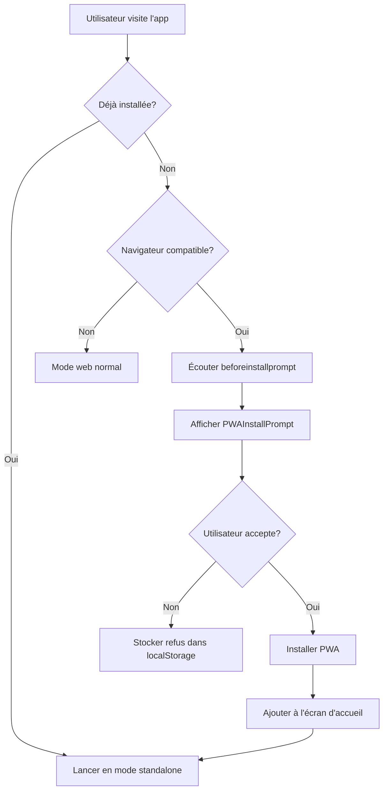

# Architecture PWA - NeuroBooth 360

## 📐 Vue d'ensemble

Cette documentation détaille l'architecture de la Progressive Web App (PWA) de NeuroBooth 360.

## 🏗️ Structure des Fichiers

```
Photobooth-360/
├── public/
│   ├── manifest.json          # Manifest PWA
│   ├── offline.html           # Page hors ligne
│   ├── logo.png               # Icône principale
│   ├── icon-192.png          # Icône 192x192
│   └── icon-512.png          # Icône 512x512
├── src/
│   ├── components/
│   │   ├── PWAInstallPrompt.tsx    # UI d'installation
│   │   └── PWAUpdatePrompt.tsx     # UI de mise à jour
│   ├── hooks/
│   │   └── usePWA.ts              # Logique PWA
│   └── vite-env.d.ts              # Types Vite + PWA
├── scripts/
│   └── generate-icons.js          # Génération d'icônes
├── vite.config.ts                 # Config Vite + PWA
└── PWA-GUIDE.md                   # Guide utilisateur
```

## 🔄 Flux d'Installation PWA



## 🛠️ Service Worker - Stratégies

### 1. Precache Strategy
**Fichiers précachés au premier chargement :**
- Tous les fichiers JS, CSS, HTML
- Images et icônes statiques
- Polices web

```typescript
// Configuré dans vite.config.ts
workbox: {
  globPatterns: ['**/*.{js,css,html,ico,png,svg,woff,woff2}']
}
```

### 2. Runtime Caching

#### Google Fonts (CacheFirst)
```typescript
{
  urlPattern: /^https:\/\/fonts\.googleapis\.com\/.*/i,
  handler: 'CacheFirst',
  options: {
    cacheName: 'google-fonts-cache',
    expiration: { maxAgeSeconds: 365 * 24 * 60 * 60 } // 1 an
  }
}
```

#### Supabase API (NetworkFirst)
```typescript
{
  urlPattern: /^https:\/\/.*\.supabase\.co\/.*/i,
  handler: 'NetworkFirst',
  options: {
    cacheName: 'supabase-cache',
    networkTimeoutSeconds: 10
  }
}
```

#### Images (CacheFirst)
```typescript
{
  urlPattern: /\.(?:png|jpg|jpeg|svg|gif|webp)$/,
  handler: 'CacheFirst',
  options: {
    cacheName: 'images-cache',
    expiration: { maxEntries: 60 }
  }
}
```

#### Vidéos (CacheFirst avec Range Requests)
```typescript
{
  urlPattern: /\.(?:mp4|webm)$/,
  handler: 'CacheFirst',
  options: {
    cacheName: 'videos-cache',
    rangeRequests: true
  }
}
```

## 📱 Composants PWA

### PWAInstallPrompt

**Responsabilités :**
- Détecter si l'app est déjà installée
- Écouter l'événement `beforeinstallprompt`
- Gérer l'UI d'installation différemment pour iOS/Android
- Stocker l'état de refus dans localStorage

**États :**
```typescript
interface PWAInstallPromptState {
  deferredPrompt: BeforeInstallPromptEvent | null;
  showPrompt: boolean;
  isIOS: boolean;
  isStandalone: boolean;
}
```

**Comportement iOS :**
```typescript
// Détecter iOS
const iOS = /iPad|iPhone|iPod/.test(navigator.userAgent);

// Afficher instructions manuelles
<ol>
  <li>Appuyez sur le bouton Partager ⎙</li>
  <li>Sélectionnez "Sur l'écran d'accueil"</li>
  <li>Appuyez sur "Ajouter"</li>
</ol>
```

**Comportement Android/Desktop :**
```typescript
// Déclencher l'installation native
const handleInstall = async () => {
  deferredPrompt.prompt();
  const { outcome } = await deferredPrompt.userChoice;
};
```

### PWAUpdatePrompt

**Responsabilités :**
- Détecter les nouvelles versions
- Afficher une notification de mise à jour
- Permettre la mise à jour immédiate
- Gérer le mode offline ready

**Flux de mise à jour :**
1. Service worker détecte une nouvelle version
2. Hook `usePWA` notifie le composant
3. Affichage de la notification
4. Utilisateur clique "Mettre à jour"
5. `updateServiceWorker(true)` est appelé
6. Page se recharge avec la nouvelle version

### usePWA Hook

**API exposée :**
```typescript
interface UsePWAReturn {
  needRefresh: boolean;      // Mise à jour disponible
  offlineReady: boolean;     // Cache prêt hors ligne
  updateAvailable: boolean;  // Alias de needRefresh
  update: () => Promise<void>; // Déclencher MAJ
  close: () => void;         // Fermer notification
}
```

**Intégration avec vite-plugin-pwa :**
```typescript
import { useRegisterSW } from 'virtual:pwa-register/react';

const {
  needRefresh: [needRefreshValue, setNeedRefreshValue],
  offlineReady: [offlineReadyValue, setOfflineReadyValue],
  updateServiceWorker,
} = useRegisterSW({
  onRegisteredSW(swUrl, registration) {
    // Vérifier mises à jour toutes les heures
    setInterval(() => registration.update(), 3600000);
  }
});
```

## 🎨 UX/UI PWA

### Prompt d'installation
- **Position** : Bottom fixed (mobile) / Right fixed (desktop)
- **Timing** : 3 secondes après le premier chargement
- **Persistance** : localStorage pour éviter le spam
- **Design** : Glass morphism avec gradient

### Notification de mise à jour
- **Position** : Top right
- **Timing** : Immédiat quand détectée
- **Actions** : "Mettre à jour" ou "Fermer"
- **Auto-hide** : Non (l'utilisateur doit agir)

### Mode offline
- **Page dédiée** : `public/offline.html`
- **Auto-refresh** : Vérification toutes les 5 secondes
- **Événement** : Écoute de `window.addEventListener('online')`

## 🔐 Sécurité

### Content Security Policy (CSP)
Recommandé pour la production :
```html
<meta http-equiv="Content-Security-Policy" 
      content="default-src 'self'; 
               script-src 'self' 'unsafe-inline' 'unsafe-eval';
               style-src 'self' 'unsafe-inline';
               img-src 'self' data: https:;
               connect-src 'self' https://*.supabase.co;">
```

### HTTPS
- **Requis** en production (sauf localhost)
- Utiliser Vercel/Netlify pour HTTPS automatique
- Ou configurer certificat SSL sur le serveur

### Permissions
```typescript
// Permissions requises
navigator.mediaDevices.getUserMedia({ video: true, audio: true })
```

## 📊 Performance

### Métriques Lighthouse

**Objectifs :**
- Performance : >90
- Accessibility : >90
- Best Practices : >90
- SEO : >90
- PWA : 100

**Optimisations :**
1. **Code Splitting** : Chunks séparés par route
2. **Lazy Loading** : Composants chargés à la demande
3. **Image Optimization** : Format WebP/AVIF
4. **Cache Strategy** : Workbox runtime caching
5. **Compression** : Brotli/Gzip en production

### Bundle Analysis

```bash
# Analyser la taille du bundle
npm run build -- --mode analyze
```

## 🧪 Tests

### Tester l'installation PWA

```bash
# 1. Build de production
npm run build

# 2. Servir localement
npm run preview

# 3. Ouvrir Chrome DevTools
# Application > Manifest > Vérifier les erreurs

# 4. Lighthouse
# Générer rapport > PWA section
```

### Tester le Service Worker

```javascript
// Dans la console Chrome
navigator.serviceWorker.getRegistrations()
  .then(registrations => console.log(registrations));

// Forcer mise à jour
navigator.serviceWorker.getRegistrations()
  .then(registrations => registrations[0].update());
```

### Tester le mode offline

```bash
# 1. Charger l'application
# 2. DevTools > Network > Offline
# 3. Recharger la page
# 4. Vérifier fonctionnement
```

## 🚀 Déploiement

### Vercel (Recommandé)

```json
// vercel.json
{
  "headers": [
    {
      "source": "/sw.js",
      "headers": [
        {
          "key": "Cache-Control",
          "value": "public, max-age=0, must-revalidate"
        }
      ]
    },
    {
      "source": "/(.*)",
      "headers": [
        {
          "key": "X-Content-Type-Options",
          "value": "nosniff"
        }
      ]
    }
  ]
}
```

### Netlify

```toml
# netlify.toml
[[headers]]
  for = "/sw.js"
  [headers.values]
    Cache-Control = "public, max-age=0, must-revalidate"

[[headers]]
  for = "/*"
  [headers.values]
    X-Frame-Options = "DENY"
    X-Content-Type-Options = "nosniff"
```

## 🐛 Debugging

### Chrome DevTools

1. **Application Tab**
   - Manifest : Vérifier configuration
   - Service Workers : État et logs
   - Cache Storage : Contenu en cache
   - Clear Storage : Réinitialiser tout

2. **Network Tab**
   - Filtrer par "ServiceWorker"
   - Vérifier les requêtes cachées (from ServiceWorker)

3. **Console**
   - Activer "Verbose" pour logs détaillés du SW

### Common Issues

**PWA non installable :**
- Vérifier HTTPS
- Manifest valide (pas d'erreurs JSON)
- Service Worker enregistré
- Icônes présentes (192px et 512px minimum)

**Service Worker ne se met pas à jour :**
- Vérifier Cache-Control headers
- Utiliser `skipWaiting: true` dans config
- Incrémenter version dans manifest

**Mode offline ne fonctionne pas :**
- Vérifier les stratégies de cache
- S'assurer que les ressources sont précachées
- Tester avec DevTools offline

## 📚 Ressources Complémentaires

- [MDN - Progressive Web Apps](https://developer.mozilla.org/fr/docs/Web/Progressive_web_apps)
- [web.dev - PWA](https://web.dev/progressive-web-apps/)
- [Workbox Documentation](https://developers.google.com/web/tools/workbox)
- [Vite PWA Plugin Docs](https://vite-pwa-org.netlify.app/)

---

**Auteur** : Architecture PWA v1.0  
**Date** : Juin 2026
